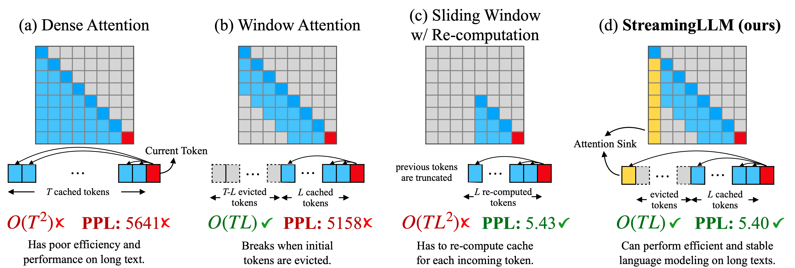

# Efficient Streaming Language Models with Attention Sinks 
[[paper](http://arxiv.org/abs/2309.17453)] [[slides](assets/StreamingLLM.pdf)][[video](https://youtu.be/hvJsEzP34o8)]



https://github.com/mit-han-lab/streaming-llm/assets/40906949/2bd1cda4-a0bd-47d1-a023-fbf7779b8358

## TL;DR
We deploy LLMs for infinite-length inputs without sacrificing efficiency and performance.

## News

- [2023/10] StreamingLLM is integrated into [Intel Extension for Transformers](https://github.com/intel/intel-extension-for-transformers).
- [2023/10] Check out [Attention Sinks](https://github.com/tomaarsen/attention_sinks), a third-party implementation to enable StreamingLLM on more Huggingface LLMs.

## Abstract
Deploying Large Language Models (LLMs) in streaming applications such as multi-round dialogue, where long interactions are expected, is urgently needed but poses two major challenges. Firstly, during the decoding stage, caching previous tokens' Key and Value states (KV) consumes extensive memory. Secondly, popular LLMs cannot generalize to longer texts than the training sequence length. Window attention, where only the most recent KVs are cached, is a natural approach --- but we show that it fails when the text length surpasses the cache size. We observe an interesting phenomenon, namely attention sink, that keeping the KV of initial tokens will largely recover the performance of window attention. In this paper, we first demonstrate that the emergence of attention sink is due to the strong attention scores towards initial tokens as a ``sink'' even if they are not semantically important. Based on the above analysis, we introduce StreamingLLM, an efficient framework that enables LLMs trained with a finite length attention window to generalize to infinite sequence length without any fine-tuning. We show that StreamingLLM can enable Llama-2, MPT, Falcon, and Pythia to perform stable and efficient language modeling with up to 4 million tokens and more. In addition, we discover that adding a placeholder token as a dedicated attention sink during pre-training can further improve streaming deployment. In streaming settings, StreamingLLM outperforms the sliding window recomputation baseline by up to 22.2x speedup.

## Usage

### Environment Setup

```bash
conda create -yn streaming python=3.8
conda activate streaming

pip install torch torchvision torchaudio
pip install transformers==4.33.0 accelerate datasets evaluate wandb scikit-learn scipy sentencepiece

python setup.py develop
```

### Run Streaming Llama Chatbot

```bash
CUDA_VISIBLE_DEVICES=0 python examples/run_streaming_llama.py  --enable_streaming
```

## FAQ

1. **What does "working on infinite-length inputs" imply for LLMs?**
   
    Handling infinite-length text with LLMs presents challenges. Notably, storing all previous Key and Value (KV) states demands significant memory, and models might struggle to generate text beyond their training sequence length. StreamingLLM addresses this by retaining only the most recent tokens and attention sinks, discarding intermediate tokens. This enables the model to generate coherent text from recent tokens without a cache reset — a capability not seen in earlier methods.

2. **Is the context window of LLMs expanded?**

    No. The context window remains unchanged. Only the most recent tokens and attention sinks are retained, discarding middle tokens. This means the model can only process the latest tokens. The context window remains constrained by its initial pre-training. For instance, if Llama-2 is pre-trained with a context window of 4096 tokens, then the maximum cache size for StreamingLLM on Llama-2 remains 4096.

3. **Can I input an extensive text, like a book, into StreamingLLM for summarization?**

    While you can input a lengthy text, the model will only recognize the latest tokens. Thus, if a book is an input, StreamingLLM might only summarize the concluding paragraphs, which might not be very insightful. As emphasized earlier, we neither expand the LLMs' context window nor enhance their long-term memory. StreamingLLM's strength lies in generating fluent text from recent tokens without needing a cache refresh.

4. **What is the ideal use case for StreamingLLM?**

    StreamingLLM is optimized for streaming applications, such as multi-round dialogues. It's ideal for scenarios where a model needs to operate continually without requiring extensive memory or dependency on past data. An example is a daily assistant based on LLMs. StreamingLLM would let the model function continuously, basing its responses on recent conversations without needing to refresh its cache. Earlier methods would either need a cache reset when the conversation length exceeded the training length (losing recent context) or recompute KV states from recent text history, which can be time-consuming.

5. **How does StreamingLLM relate to recent works on context extension?**

    StreamingLLM is orthogonal to recent context extension methods and can be integrated with them. In StreamingLLM's context, "context extension" refers to the possibility of using a larger cache size to store more recent tokens. For a practical demonstration, refer to Figure 9 in our paper, where we implement StreamingLLM with models like LongChat-7B-v1.5-32K and Llama-2-7B-32K-Instruct.

## TODOs
We will release the code and data in the following order, please stay tuned!

- [x] Release core code of StreamingLLM, including Llama-2, MPT, Falcon, and Pythia.
- [x] Release perplexity evaluation code
- [x] Release Streaming Llama Chatbot demo.
- [ ] Release StreamEval dataset and evaluation code.


## Citation

If you find StreamingLLM useful or relevant to your project and research, please kindly cite our paper:

```bibtex
@article{xiao2023streamingllm,
        title={Efficient Streaming Language Models with Attention Sinks},
        author={Xiao, Guangxuan and Tian, Yuandong and Chen, Beidi and Han, Song and Lewis, Mike},
        journal={arXiv},
        year={2023}
        }
```
